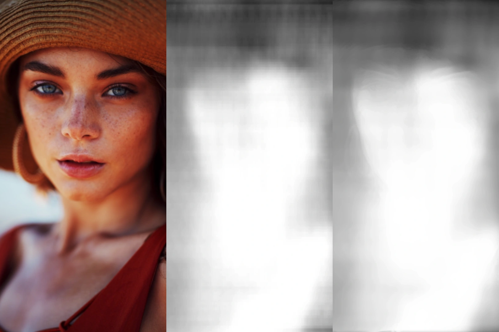

# Hi there 👋

Hey, how is it going? My name is Philipp. Let me tell you something about myself. ✌ I study Computer Science at TU Dresden (on Diploma, currently in the 9th semester). I work at TU Dresden as a developer and tutor since April 2018. Additionally, I am self-employed as a software developer and designer.
I like 🏸 badminton, 🏂 snowboarding, 🚴 cycling and 🏋 any other kind of sports. My fields of interest and expertise are:

- Applied Machine Learning and Artificial Intelligence
- Blockchain and Crypto
- Data Science and Statistics
- Cloud Computing and Distributed Systems
- Ubiquitous IOT Applications and Mobile Computing
- Educational Software and Teaching

# Weblinks

- [Twitter](https://twitter.com/snrmtths)
- [Instagram](https://instagram.com/snrmtths)
- [Blog](https://xn--53hy230o.ws/)
- [Homepage](https://philippmatth.es/)
- [E-Learning](https://fragenautom.at/)

# Featured Project

The 3Dify iOS app uses algorithms from computer vision and machine learning to generate depth maps for photos. With these depth maps, it creates a unique 3-dimensional parallax effect with the parallax occlusion mapping shading technique.

In the past days I started with a reiteration of the 3Dify app. Inspired by the work of Wei Liu et al. I implemented a postprocessing filter for the FCRN model. It uses bilateral filtering to smooth out the depth map while preserving original edges. [Read my blog entry (Link)](https://xn--53hy230o.ws/entries/3dify-filtering/)

# Profile Visits 📈

<a href="https://github.com/PhilippMatthes/PhilippMatthes">
  <kbd>
    
  </kbd>
</a>
