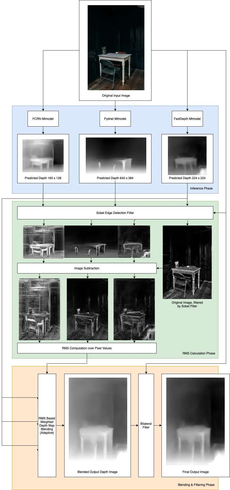

# Hi there 👋

Hey, how is it going? My name is Philipp. Let me tell you something about myself. ✌ I study Computer Science at TU Dresden (on Diploma, currently in the 9th semester). I work at TU Dresden as a developer and tutor since April 2018. Additionally, I am self-employed as a software developer and designer.
I like 🏸 badminton, 🏂 snowboarding, 🚴 cycling and 🏋 any other kind of sports. My fields of interest and expertise are:

- Applied Machine Learning and Artificial Intelligence
- Blockchain and Crypto
- Data Science and Statistics
- Cloud Computing and Distributed Systems
- Ubiquitous IOT Applications and Mobile Computing
- Educational Software and Teaching

# Weblinks

- [Twitter](https://twitter.com/snrmtths)
- [Instagram](https://instagram.com/snrmtths)
- [Blog](https://xn--53hy230o.ws/)
- [Homepage](https://philippmatth.es/)
- [E-Learning](https://fragenautom.at/)

# Featured Project

The 3Dify iOS app uses algorithms from computer vision and machine learning to generate depth maps for photos. With these depth maps, it creates a unique 3-dimensional parallax effect with the parallax occlusion mapping shading technique.

The effect is achieved by two steps:

1. Create a disparity map for the photo. On devices with multi camera arrays in portrait mode, the disparity map is provided by the AVCaptureDelegate. On devices without, the app makes use of CoreML to interpret the depth map using a custom pipeline.
2. Use a Metal driven view to apply parallax occlusion mapping, using the calculated disparity map as depth. 

On devices without the capability to create disparity maps (e.g. iPhone SE First Gen), the app makes use of a custom CoreML driven pipeline to create a disparity image:

The pipeline takes the original image as input and creates three different depth estimations using the FCRN mlmodel, the FastDepth mlmodel and the Pydnet mlmodel. To evaluate which estimated depth map is of the best quality (for blending), the pipeline computes a specific rms error value for each depth map. This is done by applying a sobel image to both the depth map as well as the original image. Then, by measuring the distance between the sobel images, a RMS value can be computed. Based on the RMS value, the pipeline blends the depth maps together. To further smoothen the surfaces of the combined depth map while preserving edges, the pipeline applies a bilateral filter which takes the edge details from the original image and smoothes the combined depth map.

# Profile Visits 📈

<a href="https://github.com/PhilippMatthes/PhilippMatthes">
  <kbd>
    
  </kbd>
</a>
